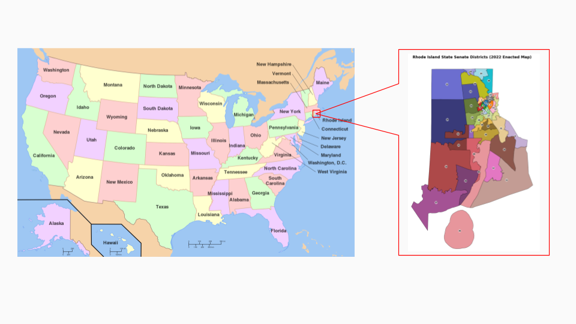
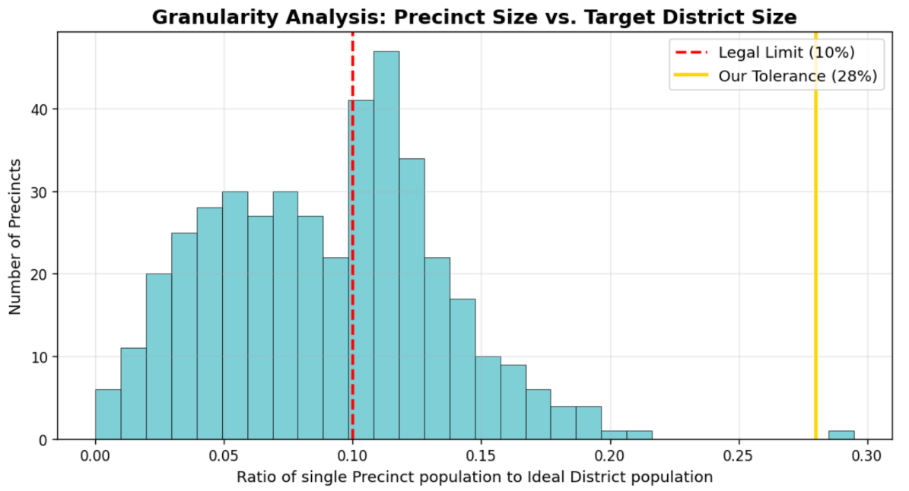
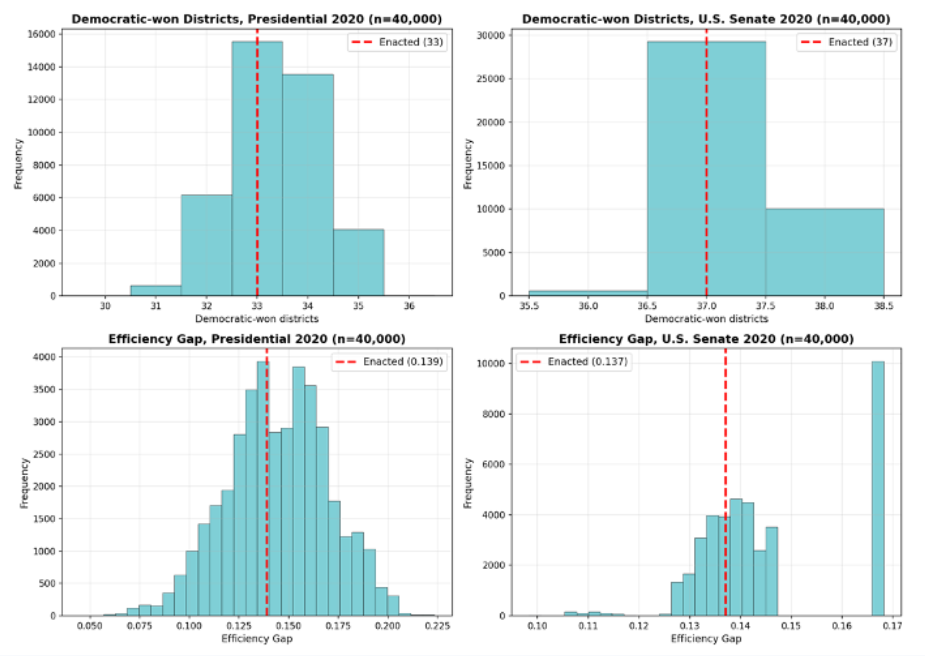
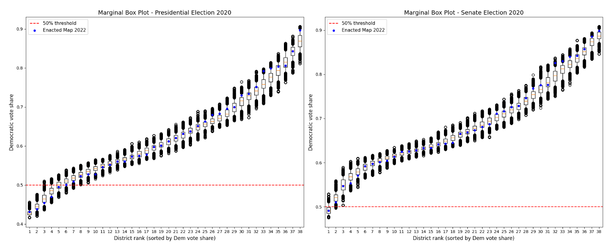
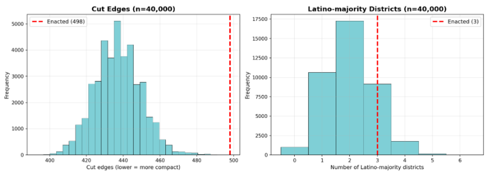
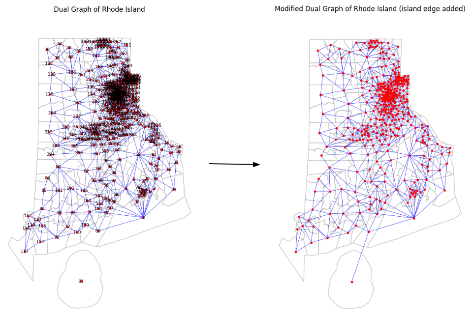

# AI for Redistricting Analysis of Rhode Island State Senate Districts

<p align="center">
  
</p>

A computational redistricting project that evaluates the fairness of Rhode Island's 2022 State Senate district map using Markov Chain Monte Carlo (MCMC) sampling and the GerryChain library.

This project generates 40,000 alternative districting plans and compares the enacted map against a statistically neutral ensemble to evaluate partisan fairness, compactness, and minority representation.

---

## Project Overview

Redistricting determines how legislative district boundaries are drawn after each U.S. Census. Because district boundaries can significantly influence election outcomes, computational methods have become an important tool for detecting potential gerrymandering.

In this project, we analyze Rhode Island's 2022 State Senate map by generating thousands of alternative districting plans using GerryChain's ReCom algorithm. The enacted plan is then compared with the simulated ensemble to determine whether it behaves like a typical neutral map or a statistical outlier.

---

## Features

- Generate 40,000 alternative districting plans using MCMC
- Perform ensemble analysis with GerryChain
- Evaluate partisan fairness across multiple elections
- Analyze district compactness using cut edges
- Measure Latino-majority district representation
- Visualize convergence diagnostics and ensemble distributions

---

## Methodology

### 1. Data Collection

The project uses publicly available datasets from the Redistricting Data Hub, including:

- 2020 Census block population
- Voting-age population
- 2020 Presidential election results
- 2020 U.S. Senate election results
- Rhode Island State Senate district boundaries
- County boundary shapefiles

### 2. Data Processing

Using GeoPandas and MAUP, the raw GIS datasets are cleaned and processed to:

- Repair shapefiles
- Aggregate census data
- Construct the dual graph
- Prepare GerryChain-compatible inputs

### 3. Ensemble Generation

Alternative districting plans are generated using GerryChain's ReCom proposal.

<p align="center">
  
</p>

The figure illustrates why a relatively large population tolerance (28%) was required due to Rhode Island's precinct granularity.

### 4. Statistical Analysis

For every generated plan, the project computes:

- Democratic seat counts
- Efficiency Gap
- Cut edges (compactness)
- Latino-majority districts
- Marginal box plots
- Running mean convergence diagnostics

---

## Results

### Ensemble Distribution

<p align="center">
  
</p>

The enacted plan falls near the center of the simulated distribution, indicating that it is not a partisan outlier.

### District Variability

<p align="center">
  
</p>

Marginal box plots compare the enacted map with the distribution of simulated district vote shares across all generated plans.

### Compactness and Minority Representation

<p align="center">
  
</p>

The enacted map is less compact than a typical neutral plan while creating slightly more Latino-majority districts than expected.

## Data Processing

<p align="center">
  
</p>

To ensure graph connectivity, Block Island was connected to the mainland by adding a bridge edge before constructing the dual graph.

Overall, the results indicate that the enacted map largely reflects Rhode Island's underlying political geography rather than intentional partisan manipulation.

---

## Repository Structure

```
.
├── FinalProjectShape.ipynb
│   Geospatial preprocessing and shapefile repair
│
├── FinalProjectChain.ipynb
│   GerryChain simulation and statistical analysis
│
├── ShapeFiles/
│   Input GIS datasets
│
├── Output/
│   Generated figures and visualizations
│
├── main.tex
│   Final project report
│
└── README.md
```

---

## Technologies

- Python
- GerryChain
- GeoPandas
- MAUP
- NetworkX
- Pandas
- NumPy
- Matplotlib
- Jupyter Notebook

---

## Example Outputs

The repository includes visualizations such as:

- Rhode Island Senate district map
- Running mean convergence plots
- Ensemble seat distributions
- Marginal box plots
- Compactness histograms
- Latino-majority district distributions

---

## Getting Started

### Clone the repository

```bash
git clone https://github.com/TianqiMin8/CS464FinalProject.git
cd CS464FinalProject
```

### Install dependencies

```bash
pip install -r requirements.txt
```

### Run the notebooks

Preprocess spatial data:

```bash
jupyter notebook FinalProjectShape.ipynb
```

Generate the ensemble and analysis:

```bash
jupyter notebook FinalProjectChain.ipynb
```

---

## Future Improvements

- Extend the framework to additional U.S. states
- Support more compactness metrics
- Evaluate additional partisan fairness measures
- Build an interactive visualization dashboard
- Optimize MCMC performance for larger states

---

## Acknowledgements

This project was completed for CS464 at the University of San Francisco.

Special thanks to Professor Veomett for introducing the concepts of computational redistricting and ensemble analysis.

Data were obtained from the Redistricting Data Hub, and district simulations were performed using the GerryChain library.
